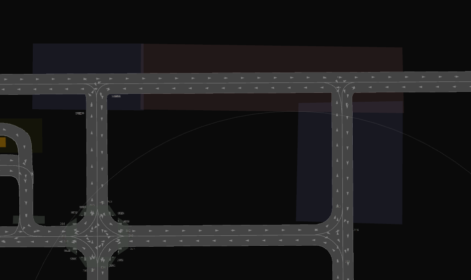

# gnss_area_recognizer

## Purpose

When switching between GNSS pose and other poses, this node will publish the localization type based on whether it's in an area that uses the GNSS pose, an area where the pose switches, or any other area.

Following are usecase examples.
- Outdoor and indoor environments are existing.
- Gnss information are unstacle in specific area.

## Requirements
### Lanelet Map Requirements
In the input lanelet map, areas representing GNSS measurement regions and regions for conducting switching need to be defined using polygons. For example, as shown in the image below, the red polygon area indicates the "GNSS available area",  signifying the availability of GNSS information. Similarly, the blue polygon area represents the "Switching area", indicating the possibility of performing switching within this region.




The length of the Switching area is calculated using the following formula:
```
x [m] = velocity [km/h] / 3.6 * ( time_span_switch + 2) 
```

Where:

"velocity" is the speed of the vehicle passing through the Switching area.  
"time_span_switch" is the threshold time used in the "pose_switcher" (default: 2 seconds).  
The factor of 2 is a value chosen empirically.

### Input

| Name | Type | Description |
| - | - | - |
| `input_lanelet2_map_bin_topic` | `autoware_auto_mapping_msgs::msg::HADMapBin` | lanelet2 map bin topic with the area where gnss is available. |
| `input_pose_with_covariance_topic` | `geometry_msgs::msg::PoseWithCovarianceStamped` | Pose topic from gnss. |

### Output

| Name | Type | Description |
| - | - | - |
| `area_localization_type"` | `map4_localization_msgs::msg::LocalizationTypeStamped` | The type of localization which is available based on current pose. |

## Parameters

### param.yaml

| Name | Type | Description | Default |
| - | - | - | - |
| `polygon_tag_name` | string | Lanelet2 polygon tag name of gnss available area. | `gnss_available_area` |
| `polygon_tag_name2` | string | Lanelet2 polygon tag name of switching area. | `switching_area` |

### launch.xml args

| Name | Type | Description | Default |
| - | - | - | - |
| `param_file_path` | string | Param.yaml file path. | `$(find-pkg-share gnss_area_filter)/config/gnss_area_filter.param.yaml` |
| `input_lanelet2_map_bin_topic` | string | input_lanelet2_map_bin_topic | `/map/vector_map` |
| `input_pose_with_covariance_topic` | string | input_pose_with_covariance_topic | `/localization/util/gnss_distortion_corrector/pose_with_covariance` |

## Related packages

 [pose_switcher](https://github.com/MapIV/pose_switcher)
